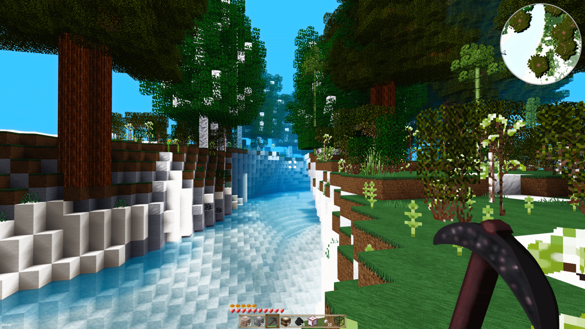

# EarthSeige
by Gabriel Sharp (Arrangement, Some Textures and Reworks)

## Contributors
Toby109tt (Pixel Perfection by Hugh "XSSheep" Rutlan) - Base Textures used as template or as rework.
The pack has textures inspired by Soartex Modded's templates and were inspired by it.

## Disclaimer
(please notify me if you see something thats yours that you want out of the pack, it could be in there by accident or by automation, i do use alot of automation tools to import/export/change files around)
osirisgothra (many of the mod-specific textures)

# Notes
Since there are over seven thousand textures, its impossible for me to know which ones might have sharing restrictions
but i will remove any such textures upon request. Just mail a list to me at osirisgothra@hotmail.com. 
See the wiki for more up to date information.

## Licensing
Creative Commons Attribution-Share Alike 4.0 International License
(note that licensing only applies to [my](mailto:osirisgothra@hotmail.com "Click here to e-mail the author who will check their mail possibly in the netherworld") work, not others. Those works, fall under their own licenses.
